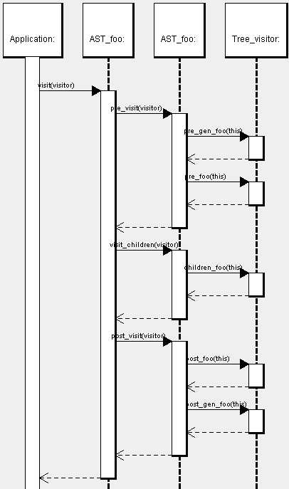
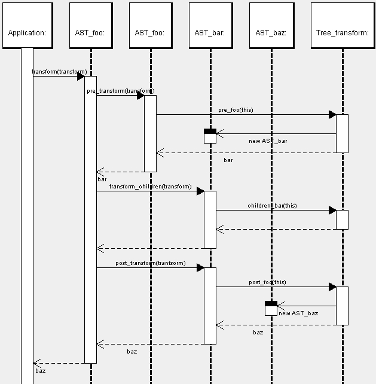

.. _apioverview:

Overview of the AST classes and transformation API
==================================================

This document explains the code for the AST classes, tree visitor API and tree
transformation API. All this code is generated by a tool called
:program:`maketea`. It does not explain how this code is derived from the |phc|
grammar; some of the details of this process are explained in :ref:`maketeatheory`.

The AST classes
---------------

There are two main kinds of AST classes: classes that correspond to
non-terminals in the grammar, and classes that correspond to terminals in the
grammar. Non-terminal classes contain an upper-case first letter.  Terminals,
or tokens, are entirely uppercase.  Examples are :class:`While`, :class:`Expr`,
:class:`METHOD_NAME` and :class:`INT`. 

The main difference is that token classes have one additional field (and
sometimes two). Every token class gets an attribute called :attr:`value`. The
type of this attribute depends on the token; for most tokens it is
:c:type:`String*` (this is the default); however, if the grammar explicitely
specifies a type for the value (in angular brackets, for example
``REAL<double>``), this overrides the default.

In addition, all the tokens classes have a method called
:func:`get_value_as_string()` and a method :func:`get_source_rep()`
when applicable. This is useful for programs that operate on general
:class:`Identifier` objects (such as :class:`METHOD_NAME` or
:class:`CLASS_NAME`) or :class:`Literal` (such as :class:`REAL` or
:class:`INT`). Note that the value returned by :func:`get_value_as_string()`
and :func:`get_source_rep()` may be different; for example,
:func:`get_source_rep()` might return ``0.5E-1``, while
:func:`get_value_as_string()` might return ``0.5``. 

All (non-terminal and terminal) then provide the following methods for deep
equality, pattern matching, cloning, calling a tree visitor and calling a tree
transformer. These methods are explained separately in sections below.

Deep Equality
-------------

Deep equality is implemented by :func:`bool deep_equals(Object* other)`. It
takes into account the entire tree structure generated by :program:`maketea`,
including any fields that are specified in the code in the grammar (see :ref:`mixin`). Thus, :func:`deep_equals()` also compares line numbers, comments,
etc.  

Cloning
-------

Cloning is implemented by :func:`deep_clone()`. Cloning makes a (deep) copy of
a tree, so the set of all pointers in the new tree is completely distinct from
the set of pointers in the old tree. The only exception to this rule is that
cloning the :class:`WILDCARD` objects (see pattern matching, below) returns the
:class:`WILDCARD` object itself. 

Pattern Matching
----------------

Pattern matching is implemented by :func:`bool match(Object* pattern)`.
Pattern matching differs from deep equality in two ways.  First, it does not
take into account any fields added by the mixin code; for example, it does not
compare line numbers or comments.  

Second, :func:`match()` supports the use of wildcards.  :program:`maketea`
generates a special class called :class:`Wildcard`. You should never
instantiate this class directly; in :file:`AST.h`, you will find the
following declaration: 

.. sourcecode:: c++

   extern Wildcard* WILDCARD;

This :class:`WILDCARD` is the sole instance of :class:`Wildcard`.  When
:func:`match()` encounters a reference to this object in a pattern, it does two
things: it skips that field in the comparison (so it acts as a "don't care"),
and it replaces the value of the field in the pattern by the value in the tree.
For example, in the body of the :keyword:`if` in 

.. sourcecode:: c++

   CLASS_NAME* name = new CLASS_NAME (new String ("SOME_CLASS"));
   CLASS_NAME* pattern = new CLASS_NAME (WILDCARD);

   if (name->match (pattern))
   {
      // ...
   }

:attr:`pattern->value` will be set to the corresponding value in :data:`name`.
Tutorials :ref:`treetutorial3` and
:ref:`treetutorial4` include examples
of the use of wildcards.

Calling any methods on the :class:`WILDCARD` object other than
:func:`deep_clone()` will lead to a runtime error.

The Visitor API
---------------

   Sequence Diagram for the Visitor API

Every AST class provides four methods to support the visitor API: :func:`void
visit(AST::Visitor*)`, :func:`void re_visit(AST::Visitor*)``, :class:`void
visit_children(AST::Visitor*)`` and :func:`void ost_visit(AST::Visitor*)``. The
implementation of each of these methods is very simple. 

:func:`visit()` simply calls :func:`pre_visit()`, :func:`visit_children()` and
:func:`post_visit()` in order. It could have been implemented once and for all
in the :class:`Node` class (but is not, for no particular reason). 

For a node :data:`x0`, which inherits from :data`x1`, which inherits from
:data:`x2`, which in turn inherits from :data:`x3`, etc.,
func:`x0::pre_visit()` calls :func:`pre_x3()`, :func:`pre_x2()`,
:func:`pre_x1()` and :func:`pre_x0()`, in that order, on the tree visitor
object, passing itself as an argument.  If :data:`x0` inherits from multiple
classes, all of the appropriate visitor methods will be invoked.  However, if
:data:`x0` inherits from both :data:`x1a` and :data:`x1b`, the programmer
should not rely on the relative order of :data:`pre_x1a` and :data:`pre_x1b`.

:func:`x0::visit_children()` simply calls :func:`children_x0()`.

:func:`x0::post_visit()` will call :func:`post_x0()`, :func:`post_x1()`, etc.
Again, if :data:`x0` inherits from both :data:`x1a` and :data:`x1b`, the
programmer should not rely on the relative order of :func:`post_x1a()` and
:func:`post_x1b()`. The only guarantee made by :program:`maketea` is that the
order of the pre-methods will be the exact reverse of the order of the
post-methods.

The Transform API
-----------------

   Sequence Diagram for the Transform API

.. todo::
   
   error in the sequence diagram, AST_foo appears twice. I think the first one
   should be AST_gen_foo?

Every AST class :class:`AST:Foo`, which inherits from :class:`AST::Gen_foo`
provides four methods to support the tree visitor API:
:func:`AST::Gen_foo transform(AST::Transform*)`, :func:`AST::Gen_foo*
pre_transform(AST::Transform*)`, :func:`void
transform_children(AST::Transform*)` and :func:`AST::Gen_foo*
post_transform(AST::Transform*)`. It is not entirely as straightforward as
this; if :class:`AST::Foo` inherits from more than one class, the return type
would probably be `AST::Foo`; in some cases, :func:`transform()` might return a
:class:`AST::Foo_list` instead. See the section :ref:`contextresolution` in the grammar
formalism for details; here we consider the programmer's perspective only. The
exact signatures for a particular class can always be found in :file:`AST.h`.
	

As with the visitor API, :func:`transform()` calls :func:`pre_transform()`,
:func:`transform_children()` and :func:`post_transform()`. However, while
:func:`transform()` calls :func:`pre_transform()` on itself, it calls
:func:`transform_children()` and :func:`post_transform()` on the node returned
by :func:`pre_transform()`. If :func:`pre_transform()` returns a vector,
:func:`transform()` calls :func:`transform_children()` and
:func:`post_transform()` on every element in that vector, assembling all the
results. 

:func:`pre_transform()` and :func:`post_transform()` simply call the
appropriate method in the :class:`AST:Transform` object.  However, if
:func:`pre_transform()` (or :func:`post_transform()`) returns a list of nodes,
the corresponding method in the tree transform object will expect two
arguments: the node to be transformed, and an empty list of nodes that will be
the return value of :func:`pre_transform()`. In that case,
:func:`pre_transform()` will first create a new empty list, pass that in as the
second argument to the corresponding method in the tree transform object, and
then return that list. 

:func:`transform_children()` just calls the corresponding method in the tree
transform object. 
