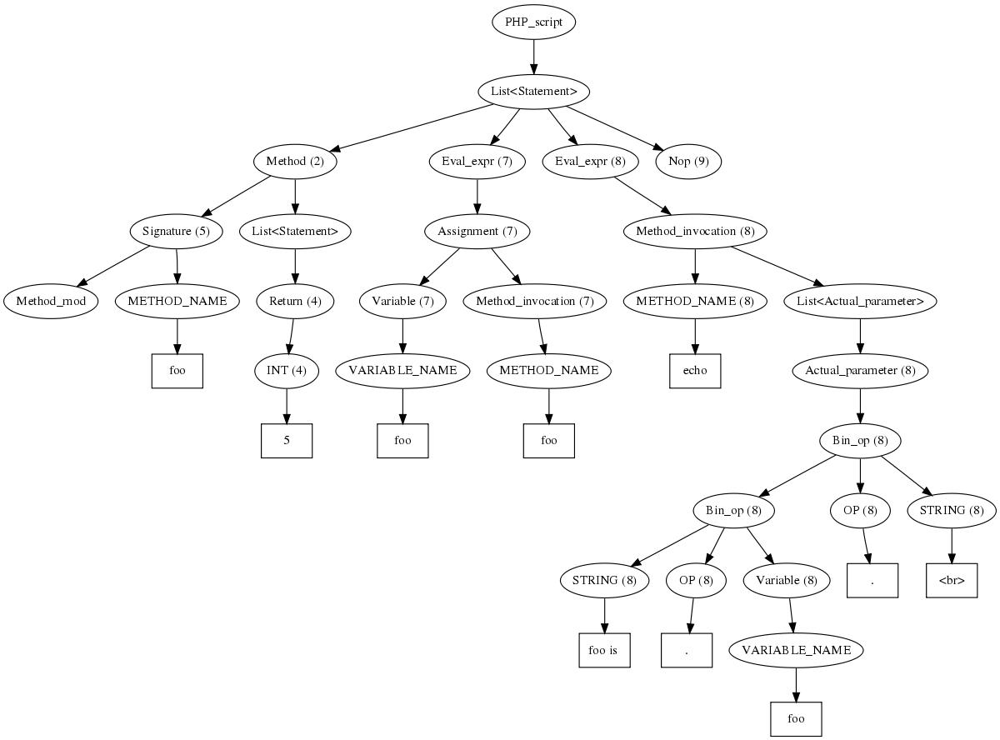

.. _demo:

Demonstration
=============

This section is intended as a quick introduction outlining what the current
release of |phc| can do for you. It does not explain everything in detail.

The Source Program
------------------

Consider the following simple PHP script.

.. sourcecode:: php

   <?php
      function foo()
      {
         return 5;
      }

      $foo = foo();
      echo "foo is $foo ";
   ?>

Internally this program gets represented as an abstract syntax tree, as
shown in figure :ref:`ast`.

.. _ast:

   Abstract syntax tree for the demo example

The Transform
-------------

Suppose we want to rename function :func:`foo()` to
:func:`bar()`. This is done by the following plugin:

.. sourcecode:: c++

   #include "AST_visitor.h"
   #include "pass_manager/Plugin_pass.h"

   class Rename_foo_to_bar : public Visitor
   {
      void pre_method_name(METHOD_NAME* in)
      {
         if(*in->value == "foo")
            in->value = new String("bar");
      }
   };

   extern "C" void run_ast (AST::PHP_script* in, Pass_manager* pm, String* option)
   {
       Rename_foo_to_bar f2b;
       php_script->visit(&f2b);
   }

   extern "C" void load (Pass_manager* pm, Plugin_pass* pass)
   {
      pm->add_after_named_pass (pass, new String("ast"));
   }
					

The Result
----------

Running |phc| gives

.. sourcecode:: php

   <?php
      function bar()
      {
         return 5;
      }

      $foo = bar();
      echo "foo is " . $foo . " ";
   ?>

where the name of the function has been changed, while the name of the variable
remained unaltered, as has the text ``"foo"`` inside the string. It's that
simple! Of course, in this example, it would have been quicker to do it by
hand, but that's not the point; the example shows how easy it is to operate on
PHP scripts within the |phc| framework.

