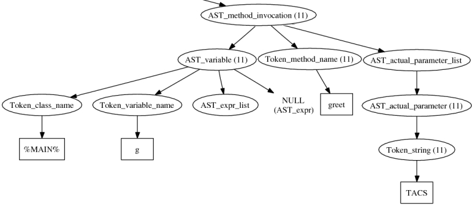
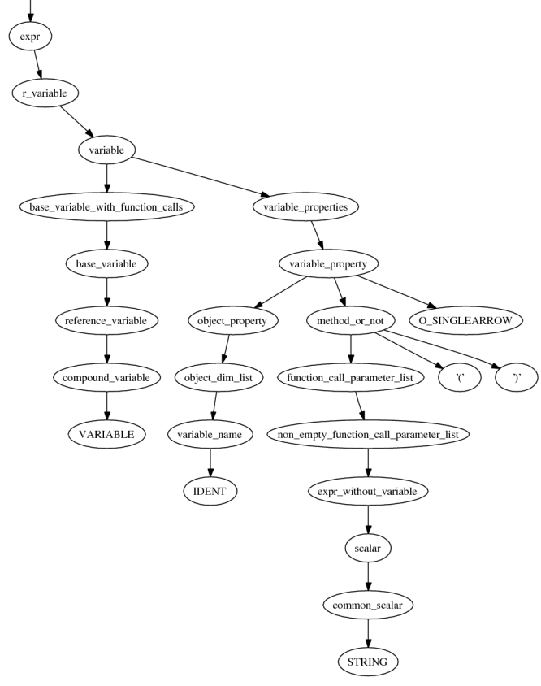

.. _representingphp:

Representing PHP
================

Most PHP constructs can immediately be represented in terms of the |phc|
grammar (:ref:`grammar`). There are a few constructs that present
some difficulties. This document describes how these difficulties are resolved,
and it explains some of the more difficult rules in the grammar.

Variables
---------

The grammar rule for variables reads

.. sourcecode:: haskell

   Variable ::= Target? Variable_name array_indices:Expr?* ;
   Variable_name ::= VARIABLE_NAME | Reflection ;

This is probably one of the more difficult rules in the grammar, so it is worth
explaining in a bit more detail. The following table describe each element of
the first rule in detail.

``Target?``

   Just like function calls, variables can have a target, and just as for
   function calls, this target can be an expression (for an object, e.g.,
   ``$x->y``) or a class name (for a static class attribute, e.g.
   ``FOO::$y``). As in function calls, in variables the target is optional
   (indicated by the question mark). If no target is specified, the variable
   refers to a *local* variable in a method.

``Variable_name``
   Again, as for function calls, the name of the variable may be a literal
   :class:`VARIABLE_NAME` (``$x``), or be given by an expression (which is wrapped
   up in an :class:`Reflection` node).  The latter possibility is referred to
   as "variable-variables" in the PHP manual.  For example, ``$$x`` is the
   variable whose name is currently stored in (another) variable called
   ``$x``.

``array_indices:Expr?*``

   A variable may have one or more array indices, for example ``$x[3][5]``. The
   strange construct ``(Expr?)*`` means: a list of (``*``) optional (``?``)
   expressions. For example, ``$x[4][]`` is a list of two expressions, but the
   second expression is not given. In PHP, this means "use the next available
   index". String- and array-indexing (``$x{3}``) are equivalent in PHP, so
   string-indexing is also represented by ``array_indices``.

We illustrate the various possibilities using diagrams.

.. warning::

   These diagrams use old names for AST nodes. Where you see
   :class:`AST_variable`, it is now called :class:`Variable` (it uses the AST
   namespace). :class:`Token_variable_name` is called :class:`VARIABLE_NAME`
   and :class:`Token_int` is called :class:`INT`.

   It is possible the structure of some nodes have changed slightly since this
   was written.

.. todo::
   
   these images need to be regenerated

.. The following paragraphs are lists headed by terms

The simple case: ``$x``

   .. image:: img/variable.jpg

   The name of the variable is ``x``, not ``$x``.

Using array indices: ``$x[1][][2]``

	.. image:: img/array_indices.jpg

   (The empty array index means "next available" in PHP)

Class constants: ``X::$y``

	.. image:: img/static_var.jpg

   Again, the variable name is ``y``, not ``$y``. The fact that you must write
   ``$x->y`` but ``X::$y`` in PHP disappears in the abstract syntax.

Variable variables: ``$$x``

   .. image:: img/var_var.jpg

   Note how the name of the variable (second component) is now given by another
   variable.

Object attributes: ``$x->y``

   .. image:: img/attribute.jpg

   The target is now given by a variable.

Variable object attributes: ``$x->$y``

	.. image:: img/var_attr.jpg

   Both the target and the variable name are given by (other) variables.

Comments
--------

A number of nodes in the AST are dedicated "commented nodes".  Their
corresponding C++ classes inherit from :class:`Commented_node`, which
introduces a :class:`String_list*` attribute called :attr:`comments`.  The
commented nodes are class members (:class:`Member`), statements
(:class:`Statement`), interface and class definitions (:class:`Interface_def`,
:class:`Class_def`), switch cases (:class:`Switch_case`) and catches
(:class:`Catch`).

When the parser encounters a comment in the input, it attaches it either to the
previous node in the AST, or to the next, according to a variable
:data:`attach_to_previous`. This variable is set as follows: 

*  It is reset to ``false`` at the start of each line
*  It is set to ``true`` after seeing a semicolon, or either of the keywords
   ``class`` or ``function``

Thus, in

.. sourcecode:: php

   foo();
   // Comment
   bar();

the comment gets attached to ``bar();`` (to be precise, to the corresponding
:class:`Eval_expr` node; the function call itself is an expression and |phc|
does not associate comments with expressions), but in

.. sourcecode:: php

   foo(); // Comment
   bar();

the comment gets attached to ``foo();`` instead. The same applies to multiple
comments:

.. sourcecode:: php

   foo(); /* A */ /* B */
   // C
   // D
   bar();

In this snippet, ``A`` and ``B`` get attached to ``foo();``, but ``C`` and
``D`` get attached to ``bar();``. Also, in the following snippet, 
			
.. sourcecode:: php

   // Comment
   echo /* one */ 1 + /* two */ 2;

all comments get attached to the same node.  This should work most of the time,
if not all the time. In particular, it should never lose any comments. If
something goes wrong with comments, please `send
<http://www.phpcompiler.org/mailinglist.html>`_ us a sample program that shows
where it goes wrong. Note that whitespace in multi-line comments gets dealt
with in a less than satisfactory way; see :ref:`limitations` for details.

String parsing
--------------

Double quoted strings and those written using the HEREDOC syntax are treated
specially by PHP: it parses variables used inside these strings and
automatically expands them with their value. |phc| handles both the simple and
complex syntax defined by PHP for variables in strings. We transform a string
like
			
.. sourcecode:: php

   "Total cost is: $total (includes shipping of $shipping)"

into:

.. sourcecode:: php

   "Total cost is: " . $total . " (includes shipping of " . $shipping . ")"

which is represented in the |phc| abstract syntax tree by a number of strings
and expressions concatenated together. Thus, as a programmer you don't need to
do anything special to process variables inside strings. Any code you write for
processing variables will also appropriately handle variables inside strings.
(Note that as of version 0.2.0, interpolated strings are correctly unparsed by
|phc|.)

``elseif``
----------

The abstract grammar does not have a construct for ``elseif``.  The following
PHP code

.. sourcecode:: php

   <?php
      if($x)
         c1();
      elseif($y)
         c2();
      else
         c3();
   ?>

gets interpreted as

.. sourcecode:: php

   <?php
      if($x)
         c1();
      else
      {
         if($y)
            c2();
         else
            c3();
      }
   ?>

The higher the number of ``elseif``\s, the greater the level of nesting. This
transformation is "hidden" by the unparser.

Miscellaneous Other Changes
---------------------------

*  Fragments of inline HTML become arguments to a function call to ``echo``.

*  The keywords :keyword:`use`, :keyword:`require`, :keyword:`require_once`,
   :keyword:`include`, :keyword:`include_once`, :keyword:`isset` and
   :keyword:`empty` all get translated into a function call to a function with
   the same name as the keyword.

*  :keyword:`exit` also becomes a call to the function :func:`exit`;
   ``exit;`` and ``exit();`` are interpreted as ``exit(0)``.

Comparison to the PHP grammar
-----------------------------

Finally, the |phc| grammar is much simpler than the official grammar, and as a
consequence more general. The class of programs that are valid according to the
abstract grammar is larger than the class of programs actually accepted by the
PHP parser. In other words, it is possible to represent a program in the
abstract syntax that does not have a valid PHP equivalent.  The advantage of
our grammar is that is much, **much** easier to work with. 

To compare, consider the tree for 

.. sourcecode:: php

   $g->greet("TACS");

Using the |phc| abstract syntax, this looks like the tree shown in figure
:ref:`abstracttree`. 
	
.. _abstracttree:

   Function call in the AST

However, in the official PHP grammar, the tree would look like the tree shown
in figure :ref:`concretetree`. 

.. _concretetree:

   Function call as represented by PHP

Not only is the number of concepts used in the tree much larger
(``base_variable_with_function_calls``, ``reference_variable``,
``variable_property``, etc. etc.), the concepts used in the |phc| tree map
directly to constructs in the PHP language; that does not hold true for the PHP
tree. Moreover, the fact that this expression is a method invocation (function
call) is immediately obvious from the root of the expression in the |phc| tree;
the root of the PHP tree says that the expression is a variable, and only
deeper down the tree does it become apparent that the expression is in fact a
function call.
