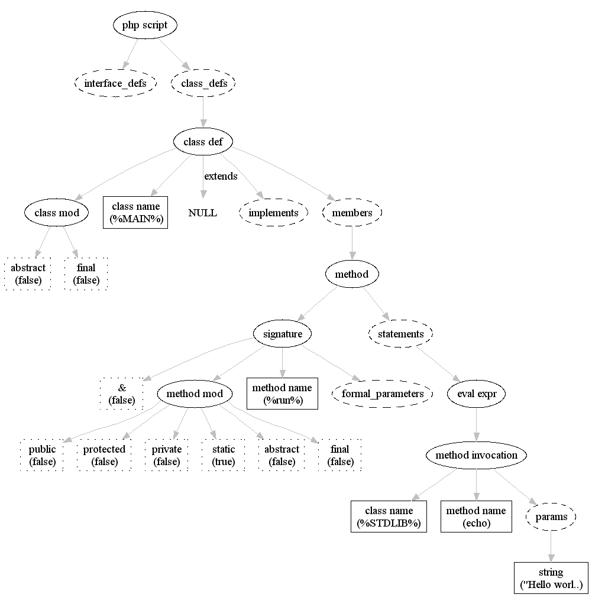

.. _runningphc:

Running phc
=============

Once you have installed |phc| (see :ref:`install`), run it by typing

.. sourcecode:: bash

   phc --help

		
You should see ::

   phc 0.2.0

   Usage: phc [OPTIONS]... [FILES]...

     -h, --help                    Print help and exit
         --full-help               Print help, including hidden options, and exit
     -V, --version                 Print version and exit

   GENERAL OPTIONS:
     -v, --verbose                 Verbose output  (default=off)
     -c, --compile                 Compile  (default=off)
         --pretty-print            Pretty print input according to the Zend style 
                                     guidelines  (default=off)
         --obfuscate               Obfuscate input  (default=off)
         --run=STRING              Run the specified plugin (may be specified 
                                     multiple times)
         --r-option=STRING         Pass option to a plugin (specify multiple flags 
                                     in the same order as multiple plugins - 1 
                                     option only per plugin)
     -d, --define=STRING           Define ini entry (only affects -c and 
                                     --include)
         --no-warnings             Allow warnings to be printed  (default=off)

   INPUT OPTIONS:
         --read-xml=PASSNAME       Assume the input is in XML format. Start 
                                     processing after the named pass (passes are 
                                     ast|hir|mir)
         --include                 Parse included or required files at 
                                     compile-time  (default=off)
         --include-harder          Try harder to find included files, possibly 
                                     slightly breaking some of PHP's rules  
                                     (default=off)

   COMPILATION OPTIONS:
     -C, --c-option=STRING         Pass option to the C compile (e.g., -C-g; can 
                                     be specified multiple times)
         --extension=EXTENSION     Generate a PHP extension called EXTENSION 
                                     instead of a standalone application
         --web-app=CONFIG          Generate a web-application (experimental)
     -O, --optimize=STRING         Optimize  (default=`0')
     -o, --output=FILE             Place executable into file FILE
     -e, --execute                 Run executable after compiling (implies -c)  
                                  (default=off)

   PRETTY PRINTING OPTIONS:
         --next-line-curlies       Output the opening curly on the next line 
                                     instead of on the same line  (default=off)
         --no-leading-tab          Don't start every line in between <?php .. ?> 
                                     with a tab  (default=off)
         --tab=STRING              String to use for tabs while unparsing  
                                     (default=`	')
         --no-hash-bang            Do not output any #! lines  (default=off)

   OUTPUT OPTIONS:
         --dump=PASSNAME           Dump input as PHP (although potentially with 
                                     gotos and labels) after PASSNAME
         --dump-xml=PASSNAME       Dump input as XML after PASSNAME
         --dump-dot=PASSNAME       Dump input as DOT after PASSNAME
         --list-passes             List of available passes (for PASSNAME)  
                                  (default=off)

   OPTIMIZATION OPTIONS:
         --flow-insensitive        Turn off flow-sensitivity  (default=off)
         --call-string-length=LENGTH
                                   Choose the call-string length ('0' indicates 
                                     infinite call-string)  (default=`0')

   More options are available via --full-help

Now write a very small PHP script, for example

.. sourcecode:: php

   <?php
      echo "Hello world!";
   ?>

and save it to :file:`helloworld.php`. Then
run |phc|:

.. sourcecode:: bash

   phc --pretty-print helloworld.php

This should output a pretty-printed version of your PHP script back to standard
output:
			
.. sourcecode:: php

   <?php
      echo "Hello world!";
   ?>

You can see a list of options controlling the style of pretty printing, using the
:option:`--full-help` option.

.. todo::
	what can phc do:
		XML
		print canonical form
		run plugins
		combine files
		obfuscate
		warnings

Compiling executables
---------------------

|phc| can compile either executables or extensions. To compile an executable,
|phc| creates C code, which it compiles and links to the PHP embed SAPI.  Since
it links to PHP, you have access to all of PHP's large built-in standard
library. In order to compile the "hello world" executable from before, run

.. sourcecode:: bash

   phc -c helloworld.php -o helloworld

This creates an executable :program:`helloworld`, which can then be run

.. sourcecode:: bash

   ./helloworld

If you prefer to run your executable immediately after it compiles, use the
:option:`-e`. |phc| will compile your program, then immediately execute it. You
can also view the C code generated by |phc|:

.. sourcecode:: bash

   phc --generate-c helloworld.php > helloworld.c

Code Optimizaton
----------------

One of the advantages of |phc| is that it can optimize your program. Using
the :option:`-O` flag, you can instruct |phc| to analyse your source code, and
perform optimizations. To optimize:

.. sourcecode:: bash

   phc -O2 -c helloworld.php -o helloworld

|phc| generates C code, which is then compiled by :program:`gcc`. To see the
command passed to :program:`gcc` by |phc|, use the :option:`-v` flag.

If you specify the :option:`-O` flag, |phc| will also pass the :option:`-O`
flag to :program:`gcc`, which will optimize your code further. The argument to the
:option:`-O` flag must therefore be usable by :program:`gcc`, so it must be any
of :option:`-O0` (default), :option:`-O1`, :option:`-O2`, :option:`-O3` or
:option:`-Os`. Consult the `gcc
manual <http://gcc.gnu.org/onlinedocs/gcc/Optimize-Options.html#Optimize-Options>`_ for more details.

It is also possible to pass command-line arguments to :program:`gcc` through |phc|,
using the :option:`-C` flag. For example, to disable inlining of the generated code
by :program:`gcc`, using :option:`-fno-inline`:

.. sourcecode:: bash

   phc -c -O2 helloworld.php -o helloworld -C-fno-inline

Should you wish to bypass phc optimizations, but still have gcc perform optimizations, you can pass 
the :option:`-O` flag to gcc via |phc|'s :option:`-C` flag:

.. sourcecode:: bash

   phc -c helloworld.php -o helloworld -C-O3

|phc| also offers a great deal of control over its optimizations, allowing the user to disable 
individual passes with the :option:`--disable` flag.  The list of passes executed can be obtained
by using the :option:`--list-passes` flag:

.. sourcecode:: bash
   
	phc --list-passes

And any pass(es) in the list can be disabled by simply passing its name as an argument to the :option:`--disable` flag:

.. sourcecode:: bash

	phc -c -O2 --disable=dce,rlb helloworld.php -o helloworld

Optimization does not currently work extremely well.  However, contributions are very welcome.  See the 'Contributors' section for 
details.

Compiling web applications
--------------------------

.. warning::

   In order to compile web applications, it is currently necessary to alter
   your :file:`php.ini` file, or have access to the root account.  We welcome
   suggetions of a different method which avoids these requirements, especially
   if they would work in a shared hosting environment.

.. warning::

   This section is experimental. Please `report any
   problems <http://www.phpcompiler.org/mailinglist.html>`_.

We have created the command-line option :option:`--web-app`, which will in the
future automate the process of compiling a web application.  Unfortunately, for
now, please follow these steps.
	
We describe how to create and install an extension using the C code generated
by |phc|. While we give an overview of creating extensions, significantly more
detail can be found in the
`Zend Extension Writing Tutorial <http://devzone.zend.com/node/view/id/1021>`_
and in
`Extending and Embedding PHP <http://www.amazon.com/dp/067232704X>`_.

To begin, create a new directory for the extension. We'll use :file:`ext/` in
our example. Generate C code from :file:`helloworld.php` using |phc|.

.. sourcecode:: bash

   phc --extension=helloworld --generate-c helloworld.php > ext/helloworld.c

Create a new file, :file:`ext/config.m4`, by copying the following, and
changing instances of "helloworld" appropriately:

.. should be m4, but pygments doesnt support it
.. sourcecode:: makefile

   PHP_ARG_ENABLE(helloworld, whether to enable Hello World support,
   [ --enable-helloworld   Enable Hello World support])

   if test "$PHP_HELLOWORLD" = "yes"; then
     AC_DEFINE(HAVE_HELLOWORLD, 1, [Whether you have Hello World])
     PHP_NEW_EXTENSION(helloworld, helloworld.c, $ext_shared)
   fi

In the previous section, we described using the PHP embed SAPI. If you
installed a copy of PHP with :option:`--enable-embed` enabled, it is important
**NOT** to use that version for the following commands.  Instead, you should
the same version as your webserver uses. From the :file:`ext/` directory, run:

.. sourcecode:: bash

   phpize --with-php-config=/usr/bin/php-config
   ./configure --enable-helloworld

Build and install the extension (if you dont have root, refer instead to :ref:`alternatemethod`):

.. sourcecode:: bash

   make
   sudo make install

In your web folder, replace the existing :file:`helloworld.php` file contents with the following:

.. sourcecode:: php

   <?php
      dl ("helloworld.so");
      __MAIN__ ();
   ?>

If the :func:`dl()` function is not enabled in your :file:`php.ini` file,
enable it:

.. sourcecode:: ini

   enable_dl = On;

Accessing :file:`helloworld.php` should now work. 

.. _alternatemethod:

Alternatives
************

Instead of setting :option:`enable_dl`, you can instead load the extension
manually in your :file:`php.ini` file:

.. sourcecode:: ini

   extension=helloworld

You can also avoid installing the extension using ``sudo make install`` by
adding an alternate extension directory:

.. sourcecode:: ini

   extensions_dir="/full/path/to/ext"

	
Writing and Reading XML
-----------------------

|phc| can output an XML representation of the PHP script. You can use this
representation if you want to process PHP scripts using tools in your desired
framework, instead of using |phc| plugins. After processing the XML
representation, |phc| can convert it back into PHP. To generate an XML version
of a PHP script, run

.. sourcecode:: bash

   ./phc --dump-xml=ast helloworld.php > helloworld.xml

When reading the XML back in, all the usual features of |phc| are again
available; in particular, it is possible to read an XML file, and write PHP
syntax. To convert the XML file we just generated back to PHP syntax, run

.. sourcecode:: bash

   ./phc --read-xml=ast --pretty-print helloworld.xml

The generated XML should use the schema `http://www.phpcompiler.org/phc-1.0 <http://www.phpcompiler.org/phc-1.0>`_.
However, our XML schema is currently broken.

Internal Representations
------------------------

After parsing, |phc| converts a PHP script into an Abstract Syntax Tree (AST)
(this is further explained in :ref:`treetutorial1`). This is very
useful for processing PHP scripts which you wish to convert back into PHP.
However, for some tasks, especially program analysis, a simpler form of the PHP
script is more suitable. |phc| offers two other Internal Representations (IRs).
The High-level Internal Representation (HIR) simplifies most expressions by
assigning them to temporary variables.  However, code represented in the HIR is
still valid PHP. The Medium-level Internal Representation (MIR) converts HIR
statements to simpler components, for example converting control-flow
statements like the ``for``-loop, into :samp:`goto`\s. To view PHP in any of
these forms, use the :option:`--dump` option:

.. sourcecode:: bash

   phc --dump=ast helloworld.php
   phc --dump=hir helloworld.php
   phc --dump=mir helloworld.php

Nearly all |phc| options work as well on the HIR and MIR as on the AST. For example, XML can be read and written:

.. sourcecode:: bash

   phc --dump-xml=hir | ./myprog | phc --read-xml=hir

Graphical Output
----------------

If you have a DOT viewer installed on your system (for example, `graphviz <http://www.graphviz.org>`_), you can view the AST
graphically. First, ask |phc| to output the AST in DOT format:

.. sourcecode:: bash

   ./phc --dump-dot=ast helloworld.php > helloworld.dot

You can then view the tree (:file:`helloworld.dot`) using Graphviz. In most
Unix/Linux systems, you should be able to do:

.. sourcecode:: bash

   dotty helloworld.dot

And you should see the tree; it should look similar to the tree shown in
figure :ref:`helloworldtree`.

.. _helloworldtree:

   Abstract syntax tree for "Hello world"

Including files
---------------

|phc| has initial support for compile-time processing of PHP's
:keyword:`include` built-in.  Enabling this feature inserts the included
statements in the AST in the place of the :keyword:`include` statement.
Included functions, classes and interfaces become part of the file's top-level
scope.  In the event that |phc| is not able to process the :keyword:`include`
statement (for example, if the file cannot be found), a warning is issued, and
the :keyword:`include` statement is left in place. To enable this support, run

.. sourcecode:: bash

   ./phc --include script_with_includes.php

The include support is intended to mimic `PHP's include
built-in <http://php.net/manual/en/function.include.php>`_, as far as can be achieved at compile time. |phc| supports:

*  Moving included statements to the point at which :keyword:`include` was
   called.  Naturally, these statement's use the variable scope at the point at
   which they are included,

*  Preserving :keyword:`__FILE__` and :keyword:`__LINE__` statements,

*  :keyword:`include`, and :keyword:`require`. If the specified file
   cannot be found, parsed, or if the argument to :keyword:`include` is not a
   string literal, the include statement is left in place.

|phc| does not support:

*  Return values in included scripts. We intend to support these in the future.
   They will likely be supported in a later stage of the compilation process,
   instead of in the AST,

*  Calling :keyword:`include` on anything other than a literal string containing the
   filename of a local file. This excludes variables and remote files. These
   may be supported when more static analyses are available,

*  :keyword:`include_once` and :keyword:`require_once`, as we cannot
   guarantee that the file to be included is not included elsewhere.  These
   statements will not be processed, and combinations of :keyword:`include` or
   :keyword:`require` and :keyword:`include_once` or :keyword:`require_once`
   may cause incorrect behaviour with this option set,

*  Updating :func:`get_included_files()` to reflect the included files.

