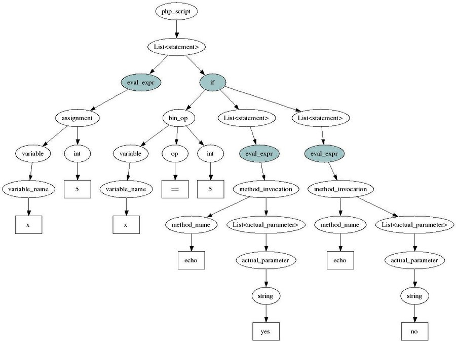

.. _treetutorial1:

Traversing the Tree
===================

In :ref:`gettingstarted`, we explained that |phc| represents PHP
scripts internally as an abstract syntax tree, and that the structure of this
tree is determined by the :ref:`grammar`. We
then showed how to make use of this tree to count the number of statements.
However, the plugin we wrote only counted the "top-level" statements.
Statements nested inside other statements (for example, statements inside the
true or false branch of an ``if`` statement) were ignored. In this tutorial, we
will rectify this problem and write a plugin that counts **all** statements in
a script. So, for
		
.. sourcecode:: php

   <?php
      $x = 5;
      if($x == 5)
         echo "yes";
      else
         echo "no";
   ?>

we should report four statements.

Note that all the plugins that we will develop in these tutorials are included
in the |phc| distribution. For example, in this tutorial we will be developing
two plugins: a difficult solution to the problem and an easy solution to the
problem. You can run these plugins by running

.. sourcecode:: bash

   phc --run plugins/tutorials/count_statements_difficult.la test.php

			
or 

.. sourcecode:: bash

   phc --run plugins/tutorials/count_statements_easy.la test.php

The Grammar (Revisited)
-----------------------

How do we go about counting all statements in a script?  Remember that, as far
as |phc| is concerned, a PHP script consists of a number of statements, but
some of those statements may have other statements nested inside them.  Here is
part of the |phc| grammar: 

.. sourcecode:: haskell

   PHP_script ::= Statement* ;
   Statement ::= Eval_expr | If | While | ...
   If ::= Expr iftrue:Statement* iffalse:Statement* ;
   While ::= Expr Statement* ;

The vertical bar (``|``) means "or". So, a statement is either an evaluation of
an expression (``eval_expr``), an ``if`` statement, or a ``while`` statement,
or..  Thus, our running example is represented by the tree in :ref:`ifx5tree`.
The four statements that we are interested in have been highlighted.

.. _ifx5tree:

   Abstract syntax tree for the running example

Statements and Expressions
--------------------------

The ``Eval_expr`` nodes in the tree probably need some explanation.  There are
many different types of statements in PHP: ``if``-statements,
``while``-statements, ``for``-loops, etc. You can find the full list in the
:ref:`grammar`. If you do look at the
grammar, you will notice in particular that a function call is not actually a
statement!  Instead, a function call is an *expression*.

The difference between statements and expressions is that a statement
*does* something (for example, a ``for``-loop repeats a
bunch of other statements), but an expression has a *value*.
For example, "5" is an expression (with value 5), ``"1+1"`` is an expression (with
value 2), etc. A function call is also considered an expression. The value of a
function call is the value that the function returns.

Now, an ``eval_expr`` makes a statement from an expression.  So, if you want to
use an expression where |phc| expects a statement, you have to use the grammar
rule

.. sourcecode:: haskell

   Statement ::= ... | Eval_expr ;
   Eval_expr ::= Expr ;

The Difficult Solution
----------------------

The following plugin is a partial solution to counting the number of statements
in a tree. If you do not understand the code, do not worry! We will look at a
much easier solution in a second. If you understand the comments, that is
enough.
			
.. sourcecode:: c++

   #include <AST.h>
   #include <pass_manager/Plugin_pass.h>

   int count(AST::Statement_list* in)
   {
      // Every item in "in" is a statement
      int num_statements = in->size();

      // But there can also be statements nested inside any
      // of the statements in "in". We consider each one in turn.
      Statement_list::const_iterator i;
      for(i = in->begin(); i != in->end(); i++)
      {
         // Check if the statement is an if-statement
         if(If* if_stmt = dynamic_cast<If*>(*i))
         {
            num_statements += count(if_stmt->iftrue);
            num_statements += count(if_stmt->iffalse);
         }
      }

      return num_statements;
   }

   extern "C" void load (Pass_manager* pm, Plugin_pass* pass)
   {
      pm->add_after_named_pass (pass, new String ("ast"));
   }

   extern "C" void run_ast (AST::PHP_script* in, Pass_manager* pm, String* option)
   {
      int num_statements = count(in->statements);
      cout << num_statements << " statements found" << endl;
   }

The overall structure of this plugin should be fairly clear. We count all the
statements in the outermost list of statements, and then consider each
statement in turn to check if there are any statements nested inside them.
This plugin will now report the correct number of statements for our example
with the ``if`` statement. However, if will report an invalid number of
statements for examples with other types of statements. For example, it will
report only two statements for

.. sourcecode:: php

   <?php
      $x = 5;
      while($x--)
      {
         echo $x;
      }
   ?>

Of course, we can fix the plugin by testing for ``while`` statements. And for
``do`` statements. And for ``foreach``, ``switch``, ``try``, etc. As mentioned,
manually dealing with the syntax tree is a laborious process!  Even something
as simple as counting the number of statements in a script becomes a large
program. Fortunately, there is a much easier solution.

The Easy Solution
-----------------

Fortunately, |phc| will do all this for you automatically! There is a standard
"do-nothing" tree traversal predefined in |phc| in the form of a class called
:class:`AST::Visitor` (defined in :file:`AST_visitor.h`). :class:`AST::Visitor`
contains methods for each type of node in the tree. |phc| will automatically
traverse the abstract syntax tree for you, and call the appropriate method at
each node.

In fact, there are **two** methods defined for each type of node. The first
method, called :func:`pre_something`, gets called on a node *before* |phc|
visits the children of the node. The second method, called ``post_something``,
gets called on a node *after* |phc| has visited the children of the node.  For
example, :func:`pre_if` gets called on an :class:`If`, before visiting the
statements in the :attr:`iftrue` and :attr:`iffalse` clauses of the
:class:`If`. After all the statements, have been visited, :func:`post_if` gets
called.

So, here is an alternative and much easier solution for our problem. This
plugin will actually count **all** statements in a script,
without having to worry about all the different ways statements can be embedded
in other statements. Moreover, even if the internal representation of |phc|
changes (for example, if another type of statement gets added), this plugin
will still work as-is.

.. sourcecode:: c++

   #include "AST_visitor.h"
   #include <pass_manager/Plugin_pass.h>

   class Count_statements : public AST::Visitor
   {
   private:
      int num_statements;

   public:
      // Set num_statements to zero before we begin
      void pre_php_script(AST::PHP_script* in)
      {
         num_statements = 0;
      }

      // Print the number of function calls when we are done
      void post_php_script(AST::PHP_script* in)
      {
         cout << num_statements << " statements found" << endl;
      }
      
      // Count the number of function calls
      void post_statement(AST::Statement* in)
      {
         num_statements++;
      }
   };

   extern "C" void load (Pass_manager* pm, Plugin_pass* pass)
   {
      pm->add_after_named_pass (pass, new String ("ast"));
   }

   extern "C" void run_ast (AST::PHP_script* in, Pass_manager* pm, String* option)
   {
      Count_statements cfc;
      in->visit(&cfc);
   }

We override a number of methods of the :class:`Visitor` class to implement the
functionality we need; the traversal is then taken care of by |phc|.

Pre and Post Methods
--------------------

We need to be precise about the order in which |phc| calls all these methods.
Suppose we have a node :class:`Foo` (say, an if-statement), which *is-a*
:class:`Bar` (say, statement), which itself *is-a* :class:`Baz` (say, commented
node).  Then |phc| calls the visitor methods in the following order:

#.  :func:`pre_baz`
#.  :func:`pre_bar`
#.  :func:`pre_foo`
#.  :func:`children_foo` (visit the children of :class:`foo`)
#.  :func:`post_foo`
#.  :func:`post_bar`
#.  :func:`post_baz`

Just to emphasise, if all of the visitor methods listed above are
implemented, they will **all** be invoked, in the order listed
above. So, implementing a more specific visitor (:func:`pre_foo`) does not
inhibit the more general method (:func:`pre_bar`) from being invoked. You can
run the :file:`plugins/tutorials/show_traversal_order.la` from the |phc|
distribution to see this in action.

.. note::

   (Advanced users) As mentioned above, if you implement :func:`pre_if`
   (say), the more general methods such as :func:`pre_statement` or
   :func:`pre_node` will still be invoked. It is possible to override
   :func:`pre_if_chain` instead; if you override :func:`pre_if_chain`, you are
   responsible for calling the more general methods manually. If you don't,
   they will not be called at all.

